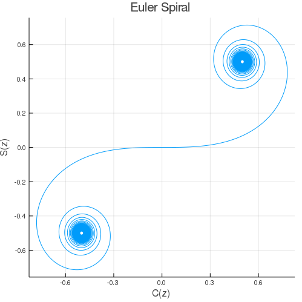

# FresnelIntegrals.jl

[](https://kshila.github.io/FresnelIntegrals.jl/stable/)
[](https://kshila.github.io/FresnelIntegrals.jl/dev/)
[](https://github.com/kshila/FresnelIntegrals.jl/actions/workflows/CI.yml?query=branch%3Amain)
[](https://codecov.io/gh/kshila/FresnelIntegrals.jl)

A quick Julia library for calculating Fresnel Integrals using the error function from [SpecialFunctions.jl](https://github.com/JuliaMath/SpecialFunctions.jl).

```julia
using FresnelIntegrals
using Plots

z = -30:0.001:30
plot(x->real(fresnelc(x)), x->real(fresnels(x)),z,legend=false)
title!("Euler Spiral")
xlabel!("C(z)")
ylabel!("S(z)")
```


As expected, this is much faster than the numeric integral solution

```julia
using QuadGK
using FresnelIntegrals

julia> @benchmark fresnelc(1.8)
BenchmarkTools.Trial:
  memory estimate:  0 bytes
  allocs estimate:  0
  --------------
  minimum time:     410.815 ns (0.00% GC)
  median time:      412.035 ns (0.00% GC)
  mean time:        426.088 ns (0.00% GC)
  maximum time:     1.017 μs (0.00% GC)
  --------------
  samples:          10000
  evals/sample:     200

julia> @benchmark quadgk(t->cos(π*t^2/2),0,1.8)
BenchmarkTools.Trial:
  memory estimate:  1.00 KiB
  allocs estimate:  42
  --------------
  minimum time:     2.181 μs (0.00% GC)
  median time:      2.250 μs (0.00% GC)
  mean time:        3.357 μs (31.54% GC)
  maximum time:     7.919 ms (99.89% GC)
  --------------
  samples:          10000

```
